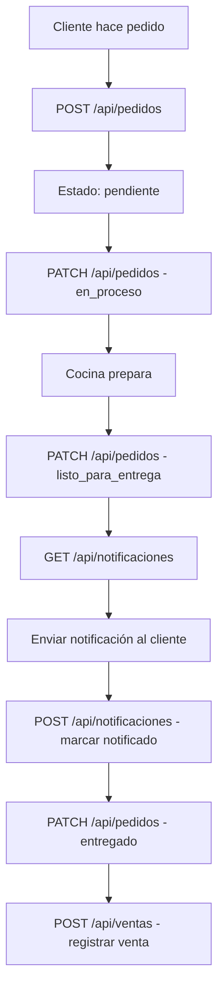

# 🚀 Guía Rápida de Inicio - MongoDB

## ⚡ Inicio Rápido (5 minutos)

### 1. Configurar MongoDB Atlas

1. Ve a [MongoDB Atlas](https://www.mongodb.com/cloud/atlas/register)
2. Crea una cuenta gratuita
3. Crea un nuevo cluster (Free Tier M0)
4. En "Database Access", crea un usuario con contraseña
5. En "Network Access", agrega tu IP (o permite acceso desde cualquier lugar: `0.0.0.0/0`)
6. Haz clic en "Connect" → "Connect your application"
7. Copia la connection string

### 2. Configurar Variables de Entorno

Crea el archivo `.env.local` en la raíz del proyecto:

```env
MONGODB_URI=mongodb+srv://<username>:<password>@cluster0.xxxxx.mongodb.net/restaurante_db?retryWrites=true&w=majority
MONGODB_DB_NAME=restaurante_db
```

**Reemplaza:**
- `<username>` con tu usuario de MongoDB
- `<password>` con tu contraseña
- `cluster0.xxxxx.mongodb.net` con tu URL de cluster

### 2. Verificar Instalación

La dependencia de MongoDB ya está instalada. Verifica que esté en `package.json`:

```json
{
  "dependencies": {
    "mongodb": "^7.0.0"
  }
}
```

### 3. Iniciar el Servidor

Inicia el servidor de desarrollo:

```bash
npm run dev
```

### 4. Verificar la Conexión

Deberías ver en la consola del servidor:

```
✅ MongoDB conectado exitosamente
📍 Tipo de conexión: LOCAL  (o REMOTA si usas Atlas)
📦 Base de datos: restaurante_db
```

Prueba el endpoint de health en tu navegador:
```
http://localhost:3000/api/health
```

Si ves `{"success":true,"status":"connected",...}`, ¡la conexión funciona! ✅

---

## 📚 Estructura Creada

```
Tu Proyecto/
├── lib/
│   ├── mongodb.ts              ← Configuración de conexión
│   └── types/
│       └── mongodb.ts          ← Tipos TypeScript
├── app/
│   └── api/
│       ├── bots/route.ts       ← API de bots
│       ├── restaurantes/route.ts
│       ├── categorias/route.ts
│       ├── horarios/route.ts
│       ├── productos/route.ts
│       ├── clientes/route.ts
│       ├── pedidos/route.ts
│       ├── ventas/route.ts
│       ├── notificaciones/route.ts
│       └── reportes/
│           └── ventas/route.ts
├── scripts/
│   └── inicializar-datos.ts   ← Script de datos de prueba
├── .env.local                  ← Variables de entorno (créalo)
├── .env.local.example          ← Plantilla
└── MONGODB_SETUP.md            ← Documentación completa
```

---

## 🎯 Endpoints Disponibles

### Básicos
- `GET/POST /api/bots` - Gestión de bots
- `GET/POST /api/restaurantes` - Gestión de restaurantes
- `GET/POST /api/categorias` - Gestión de categorías
- `GET/POST /api/horarios` - Gestión de horarios
- `GET/POST/PATCH /api/productos` - Gestión de productos
- `GET/POST /api/clientes` - Gestión de clientes

### Operacionales
- `GET/POST/PATCH /api/pedidos` - Gestión de pedidos
- `GET/POST /api/ventas` - Registro de ventas

### Avanzados
- `GET/POST /api/notificaciones` - Sistema de notificaciones
- `GET /api/reportes/ventas` - Reportes de ventas

---

## 🧪 Probar los Endpoints

### Con Thunder Client / Postman

#### Ejemplo 1: Crear un Bot
```http
POST http://localhost:3000/api/bots
Content-Type: application/json

{
  "username": "mi_bot_restaurante"
}
```

#### Ejemplo 2: Crear un Restaurante
```http
POST http://localhost:3000/api/restaurantes
Content-Type: application/json

{
  "username_bot": "mi_bot_restaurante",
  "nombre": "Mi Restaurante",
  "telefono": "+34 912 345 678",
  "direccion": {
    "calle": "Calle Principal 123",
    "ciudad": "Madrid",
    "distrito": "Centro"
  }
}
```

#### Ejemplo 3: Crear una Categoría
```http
POST http://localhost:3000/api/categorias
Content-Type: application/json

{
  "nombre": "Pizzas",
  "descripcion": "Pizzas artesanales al horno de leña"
}
```

#### Ejemplo 4: Crear un Producto
```http
POST http://localhost:3000/api/productos
Content-Type: application/json

{
  "id_restaurant": "674XXXXXXXXXXXXXXXX",
  "nombre": "Pizza Margherita",
  "precio": 12.50,
  "categoria": "Pizzas",
  "descripcion": "Tomate, mozzarella y albahaca",
  "prep_time_min": 15,
  "disponible": true
}
```

**Nota:** Reemplaza `674XXXXXXXXXXXXXXXX` con el `_id` del restaurante que creaste.

### Con curl (Terminal)

```bash
# Obtener todos los bots
curl http://localhost:3000/api/bots

# Crear un bot
curl -X POST http://localhost:3000/api/bots \
  -H "Content-Type: application/json" \
  -d '{"username":"test_bot"}'

# Obtener productos de un restaurante
curl "http://localhost:3000/api/productos?id_restaurant=674XXXXXXXXXXXXXXXX"

# Generar reporte de ventas de hoy
curl http://localhost:3000/api/reportes/ventas
```

---

## 🔄 Flujo Completo de Pedido



---

## 🐛 Solución de Problemas

### Error: "MONGODB_URI is not defined"
**Solución:** Crea el archivo `.env.local` con tu connection string

### Error: "MongoServerError: bad auth"
**Solución:** Verifica usuario y contraseña en MongoDB Atlas

### Error: "Network timeout"
**Solución:** Agrega tu IP en "Network Access" en MongoDB Atlas

### Error: Cannot find module 'mongodb'
**Solución:** Ejecuta `npm install mongodb`

### Los cambios en .env.local no se aplican
**Solución:** Reinicia el servidor (`Ctrl+C` y luego `npm run dev`)

---

## 📖 Documentación Completa

Para más detalles, consulta:
- **MONGODB_SETUP.md** - Documentación completa de APIs y ejemplos
- **scripts/inicializar-datos.ts** - Script para crear datos de prueba

---

## 🎨 Integrar con tu Frontend

### Ejemplo en React/Next.js

```typescript
'use client'

import { useEffect, useState } from 'react'

export default function ProductosPage() {
  const [productos, setProductos] = useState([])
  
  useEffect(() => {
    async function fetchProductos() {
      const response = await fetch('/api/productos')
      const data = await response.json()
      if (data.success) {
        setProductos(data.data)
      }
    }
    fetchProductos()
  }, [])
  
  return (
    <div>
      <h1>Productos</h1>
      <ul>
        {productos.map(producto => (
          <li key={producto._id}>
            {producto.nombre} - €{producto.precio.toString()}
          </li>
        ))}
      </ul>
    </div>
  )
}
```

---

## ✅ Checklist de Configuración

- [ ] Crear cuenta en MongoDB Atlas
- [ ] Crear cluster gratuito
- [ ] Crear usuario de base de datos
- [ ] Configurar Network Access
- [ ] Copiar connection string
- [ ] Crear archivo `.env.local`
- [ ] Agregar `MONGODB_URI` y `MONGODB_DB_NAME`
- [ ] Iniciar servidor (`npm run dev`)
- [ ] Probar endpoint `/api/bots`
- [ ] Crear datos de prueba (opcional)

---

## 🚀 Siguientes Pasos

1. **Crear datos de prueba**: Usa Postman o Thunder Client para crear algunos bots, restaurantes y productos
2. **Explorar reportes**: Prueba `/api/reportes/ventas` para ver análisis
3. **Implementar notificaciones**: Configura envío de emails o SMS
4. **Agregar autenticación**: Protege tus endpoints con NextAuth o similar
5. **Optimizar con índices**: Crea índices en MongoDB para mejor rendimiento

---

## 💡 Tips

- Usa **MongoDB Compass** para visualizar tus datos (descárgalo gratis)
- Activa **MongoDB Atlas Search** para búsquedas avanzadas
- Configura **backups automáticos** en Atlas (disponible en planes pagos)
- Monitorea el uso con el **Performance Advisor** de Atlas

---

## 📞 Recursos Útiles

- [MongoDB Atlas](https://www.mongodb.com/cloud/atlas)
- [MongoDB Compass](https://www.mongodb.com/products/compass)
- [MongoDB University](https://university.mongodb.com/) - Cursos gratis
- [Next.js Docs](https://nextjs.org/docs)

---

**¡Listo para empezar! 🎉**

Si tienes dudas, revisa `MONGODB_SETUP.md` para documentación detallada.
